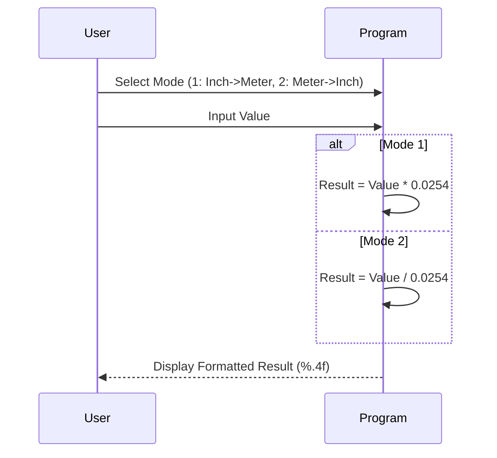

# 📏 Unit Converter Application

<div align="center">


**"Metric to Imperial Unit Conversion Logic"**

</div>

---

## 🎯 Problem Statement
โปรแกรมแปลงหน่วยวัด (Unit Conversion) เป็นตัวอย่างที่ดีของการประยุกต์ใช้คณิตศาสตร์ร่วมกับเงื่อนไขทางโปรแกรม โจทย์คือการสร้างเครื่องมือแปลงค่าระหว่าง **นิ้ว (Inches)** และ **เมตร (Meters)**

## 🏗️ Process Diagram



## 💻 Code Snippet
Constants defined for precision and maintainability.

```c
#define INCH_TO_METER 0.0254

if (choice == 1) {
    printf("%.4f inches = %.4f meters", val, val * INCH_TO_METER);
} else {
    printf("%.4f meters = %.4f inches", val, val / INCH_TO_METER);
}
```

## 💡 Key Learnings
- **Floating Point Precision**: การใช้ `double` และ `%.4f` เพื่อจัดการทศนิยมให้แม่นยำ
- **Constants Definition**: การใช้ `#define` แทน Magic Number ในสูตรคำนวณ
