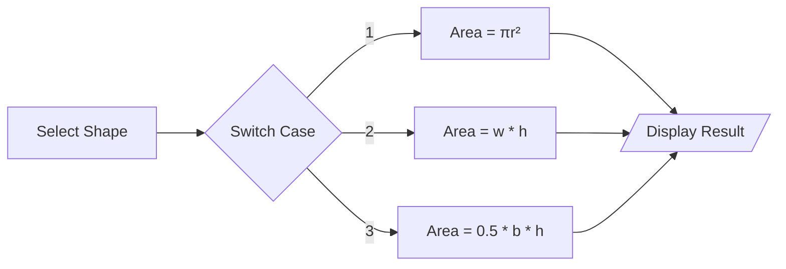

# 📐 Area Calculation Logic

<div align="center">


</div>

---

## 🎯 Problem Statement
โปรแกรมคำนวณพื้นที่ (Area) ของรูปทรงต่างๆ เช่น วงกลม, สี่เหลี่ยม, และสามเหลี่ยม โดยเน้นการใช้ **User Input** และการแยก **Function**

## 🏗️ Algorithm Flow



## 💻 Tech Implementation
Using `#define` macros for constants and `switch-case` for menu selection.

```c
#define PI 3.14159

void main() {
    int choice;
    printf("1. Circle\n2. Rectangle\nChoose: ");
    scanf("%d", &choice);
    // ... logic inside switch
}
```
