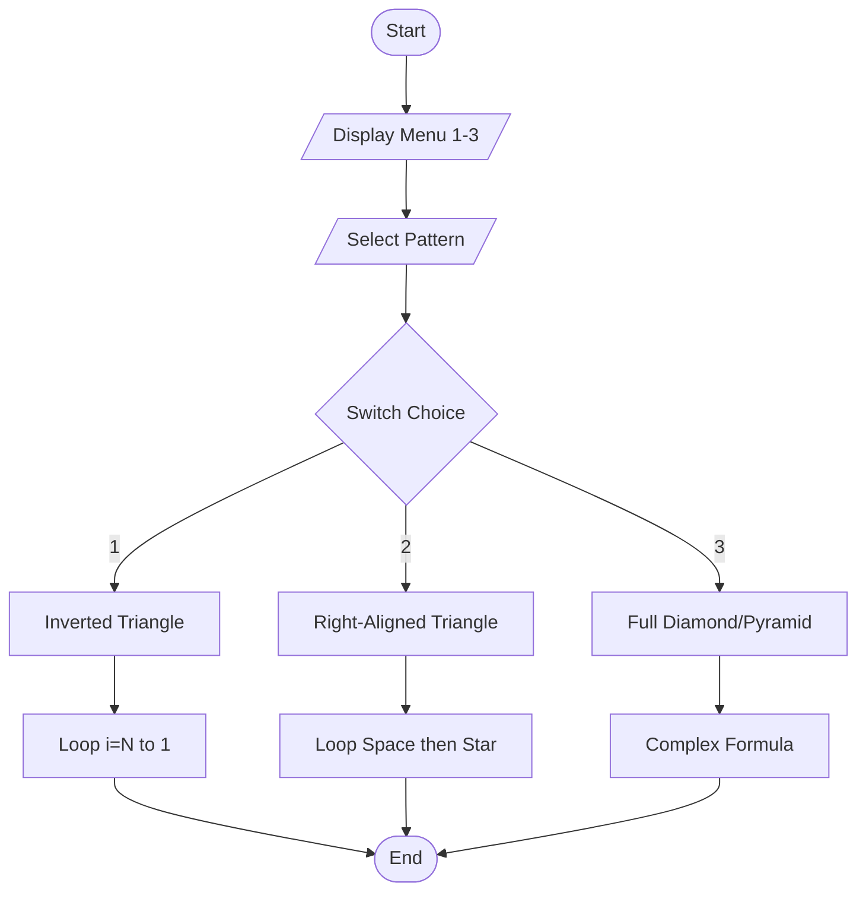

# 🌟 Advanced Pyramid Patterns

<div align="center">


**"Mastering Complex Nested Loops Logic"**

</div>

---

## 🎯 Problem Statement
การสร้างรูปทรงเรขาคณิตด้วยตัวอักษรเป็นแบบฝึกหัดคลาสสิกที่ทดสอบความเข้าใจเรื่อง **Algorithm Design** โจทย์นี้ยกระดับความยากจากพีระมิดปกติ เป็นการรวม 3 รูปแบบไว้ในเมนูเดียว

## 🏗️ Algorithm Flowchart



## 💻 Logic Breakdown

### Pattern 3: Full Pyramid
ต้องจัดการ Loop 3 ส่วน: บรรทัด (`i`), ช่องว่าง (`space`), และดาว (`star`)

```c
for(int i = 1; i <= rows; i++) {
    // 1. Print Leading Spaces
    for(int space = 1; space <= rows-i; space++) {
        printf(" ");
    }
    // 2. Print Stars (Odd Number Sequence: 1, 3, 5...)
    for(int star = 1; star <= (2*i-1); star++) {
        printf("*");
    }
    printf("\n");
}
```

## 💡 Key Learnings
- **Space-Star Relationship**: ความสัมพันธ์แบบผกผันระหว่างบรรทัดและช่องว่าง (บรรทัดเพิ่ม = ช่องว่างลด)
- **Mathematical Series**: การใช้อนุกรมเลขคณิต `2n-1` เพื่อหาจำนวนดาว
