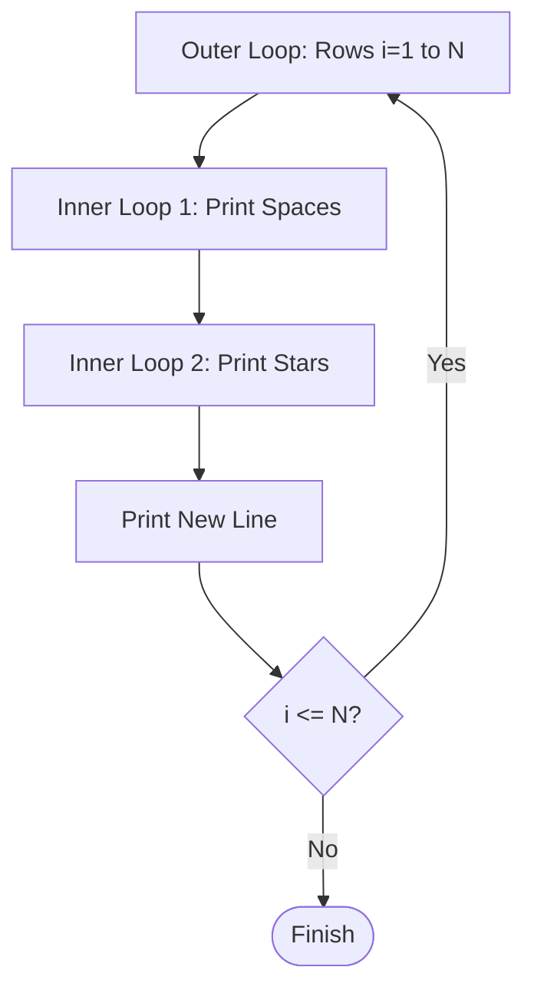

# 🔺 Pyramid Pattern Printing (C Logic)

<div align="center">


**"Mastering Control Flow with Nested Iterations"**

</div>

---

## 🎯 Problem Statement
หนึ่งในโจทย์ปราบเซียนสำหรับผู้เริ่มต้นเขียนโปรแกรมคือ "Nested Loop" (Loop ซ้อน Loop) การพิมพ์รูปทรงพีระมิดต้องใช้ตรรกะทางคณิตศาสตร์ความสัมพันธ์ระหว่าง "บรรทัด" (Row), "ช่องว่าง" (Space), และ "ดอกจัน" (Star)

## 🏗️ Loop Visualization



## 📐 Mathematical Logic
สำหรับพีระมิดความสูง `n`:
- **Spaces**: `n - i` ช่อง
- **Stars**: `2*i - 1` ดวง

```c
// Example for Row i
for(j = 1; j <= n-i; j++) printf(" ");  // Print Spaces
for(k = 1; k <= 2*i-1; k++) printf("*"); // Print Stars
```

## 💡 Key Learnings
- **Index Manipulation**: การจัดการตัวแปร `i, j, k` ใน Loop ซ้อนกัน
- **Pattern Recognition**: การมอง Output ให้ออกเป็นสมการคณิตศาสตร์
