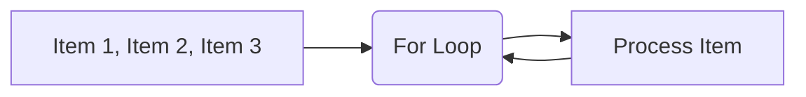

# 🔄 Lab 10: Control Flow (Loops)

<div align="center">


**"Automating Repetitive Tasks"**

</div>

---

## 🎯 Objective
การวนซ้ำ (Iteration) เป็นพลังที่แท้จริงของคอมพิวเตอร์ Lab นี้เน้นการใช้ `for` loop กับ List และ `range()` รวมถึง `while` loop ในบางสถานการณ์

## 🏗️ Iteration Diagram



## 💻 Code Highlights
```python
# Loop through List
names = ["Alice", "Bob", "Charlie"]
for name in names:
    print(f"Hello, {name}")

# Range
for i in range(5): # 0 to 4
    print(i)
```
