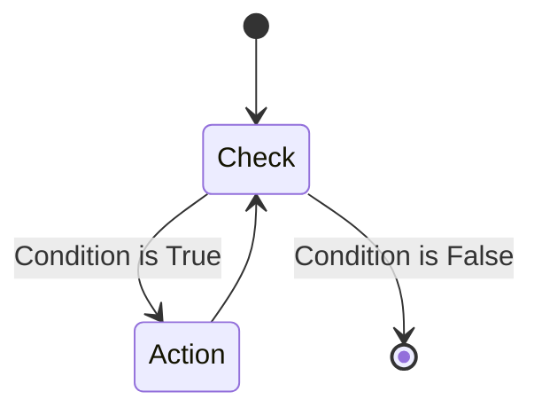

# 🔄 Lab 11: Control Flow (While Loop)

<div align="center">


**"Looping Based on Conditions"**

</div>

---

## 🎯 Objective
ทดลองใช้ `while` loop ซึ่งจะทำงานซ้ำไปเรื่อยๆ ตราบเท่าที่เงื่อนไขยังเป็นจริง (True) เหมาะสำหรับสถานการณ์ที่ไม่รู้จำนวนรอบที่แน่นอน

## 🏗️ State Diagram



## 💻 Code Example
```python
count = 0
while count < 5:
    print(f"Count is {count}")
    count += 1
```
