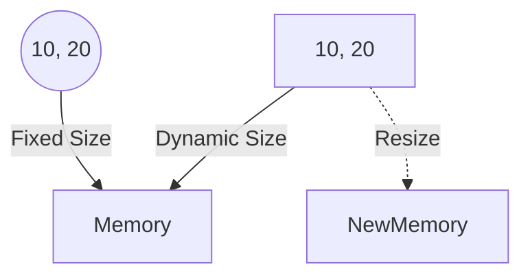

# 🔒 Lab 13: Tuples (Immutable Lists)

<div align="center">


**"Read-Only Data Structures"**

</div>

---

## 🎯 Objective
ทำความเข้าใจ **Tuple** ซึ่งเหมือน List แต่ "ห้ามแก้ไข" (Immutable) เหมาะสำหรับเก็บข้อมูลค่าคงที่ เช่น พิกัด GPS หรือ Config

## 🏗️ Memory Concept
Tuple เร็วกว่า List และใช้ Memory น้อยกว่าเพราะขนาดคงที่



## 💻 Code Snippet
```python
# Unpacking Tuple
point = (10, 20)
x, y = point
print(f"X: {x}, Y: {y}")
```
