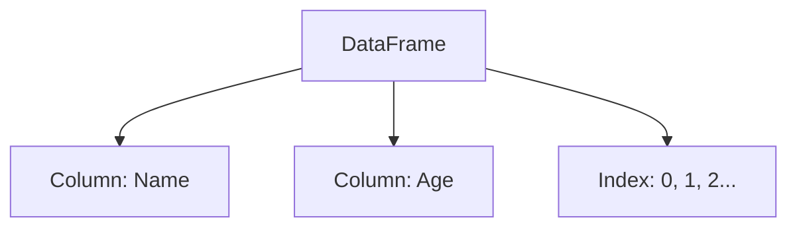

# 🐼 Lab 17: Pandas DataFrame

<div align="center">


**"Data Manipulation and Analysis Tool"**

</div>

---

## 🎯 Objective
ทำความรู้จัก **Pandas**, เครื่องมือที่ทรงพลังที่สุดสำหรับ Data Analysis ใน Python เรียนรู้โครงสร้าง `Series` และ `DataFrame` (ตารางข้อมูล)

## 🏗️ DataFrame Structure



## 💻 Tech Spec
- **read_csv()**: อ่านไฟล์ข้อมูลเข้าสู่ DataFrame
- **head()**, **describe()**: คำสั่งสำรวจข้อมูลเบื้องต้น

```python
import pandas as pd
df = pd.read_csv('data.csv')
print(df.head())
```
