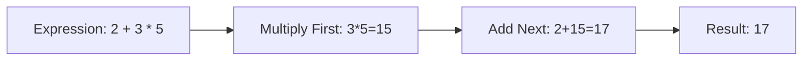

# 🧮 Lab 3: Basic Calculation

<div align="center">


**"Python as a Calculator"**

</div>

---

## 🎯 Objective
ฝึกการใช้ Python คำนวณทางคณิตศาสตร์พื้นฐาน (+, -, *, /) และลำดับความสำคัญของเครื่องหมาย (PEMDAS)

## 🏗️ Operations Flow



## 💻 Code Snippet
```python
a = 10
b = 3
print(a + b)  # Addition
print(a ** b) # Power (10^3)
print(a % b)  # Modulo (Remainder)
```
