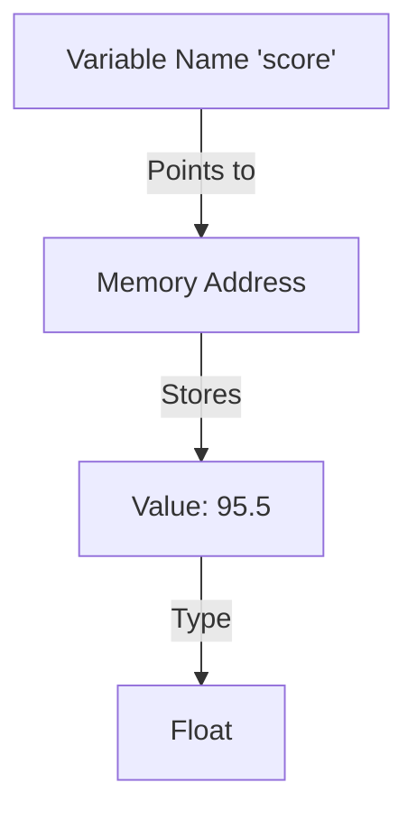

# 📦 Lab 5: Variables & Types

<div align="center">


**"Storing and Manipulating Data"**

</div>

---

## 🎯 Objective
ทำความเข้าใจเกี่ยวกับการประกาศตัวแปร (Declaration) และชนิดข้อมูล (Data Types) ที่สำคัญใน Python เช่น `int`, `float`, `str`, และ `bool`

## 🏗️ Variable Mapping



## 💻 Tech Spec
- **Dynamic Typing**: Python ไม่ต้องประกาศประเภทตัวแปร ล่วงหน้า
- **Naming Convention**: ควรใช้ `snake_case` สำหรับชื่อตัวแปร

```python
name = "Alice"   # String
age = 20         # Integer
height = 1.65    # Float
is_student = True # Boolean
```
