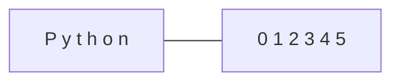

# 🔤 Lab 7: String Manipulation

<div align="center">


**"Mastering Text Data Cleaning"**

</div>

---

## 🎯 Objective
ข้อมูลในโลกจริงส่วนใหญ่เป็นข้อความ (Text) Lab นี้สอนการจัดการ Strings ทั้งการตัดคำ (Slicing), การค้นหา, และการจัดรูปแบบ (Formatting) ซึ่งจำเป็นมากสำหรับงาน NLP

## 🏗️ Slicing Logic
`text[start:stop:step]`



## 💻 Code Highlights
```python
text = "  Data Science  "
clean = text.strip().upper() # Remove space & upper case
print(f"Cleaned: {clean}")   # f-string formatting
```
