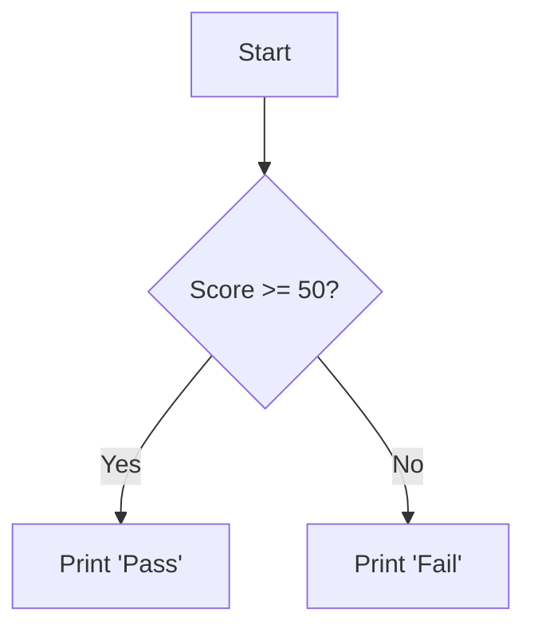

# 🚦 Lab 9: Control Flow (Conditions)

<div align="center">


**"Logic and Decision Making in Python"**

</div>

---

## 🎯 Objective
การเขียนโปรแกรมให้ "คิด" ได้ ต้องใช้เงื่อนไข `if-elif-else` เพื่อควบคุมทิศทางการทำงานของโปรแกรมตามข้อมูลที่ได้รับ

## 🏗️ Logic Flowchart



## 💻 Code Snippet
```python
score = 75
if score >= 80:
    grade = "A"
elif score >= 70:
    grade = "B"
else:
    grade = "F"
```
