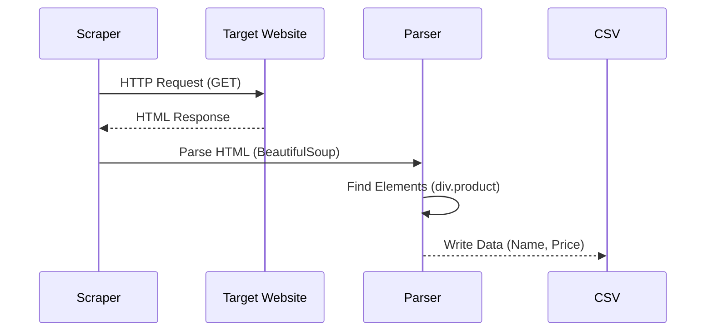

# 🕷️ Web Scraping Group Project

<div align="center">


**"Extracting Real-world Data from Websites"**

</div>

---

## 🎯 Problem Statement
ข้อมูลที่มีค่าส่วนใหญ่ไม่ได้อยู่ในรูปแบบ API แต่อยู่บนหน้าเว็บไซต์ โจทย์คือการสร้าง **Scraper** เพื่อดึงข้อมูลสินค้า/ราคา มาวิเคราะห์ต่อ

## 🏗️ Scraping Pipeline



## 💻 Tech Stack
- **Requests**: สำหรับยิง HTTP GET
- **BeautifulSoup4**: สำหรับแปลง HTML เป็น Object ที่ค้นหาได้
- **Pandas**: สำหรับจัดรูปแบบข้อมูลก่อน Save เป็น CSV

```python
soup = BeautifulSoup(response.content, 'html.parser')
prices = soup.find_all('span', class_='price')
```

## 💡 Key Learnings
- **HTML DOM**: โครงสร้าง Tree ของหน้าเว็บ
- **Ethics**: มารยาทในการ Scraping (ตรวจสอบ `robots.txt` และไม่ยิง Request ถี่เกินไป)
