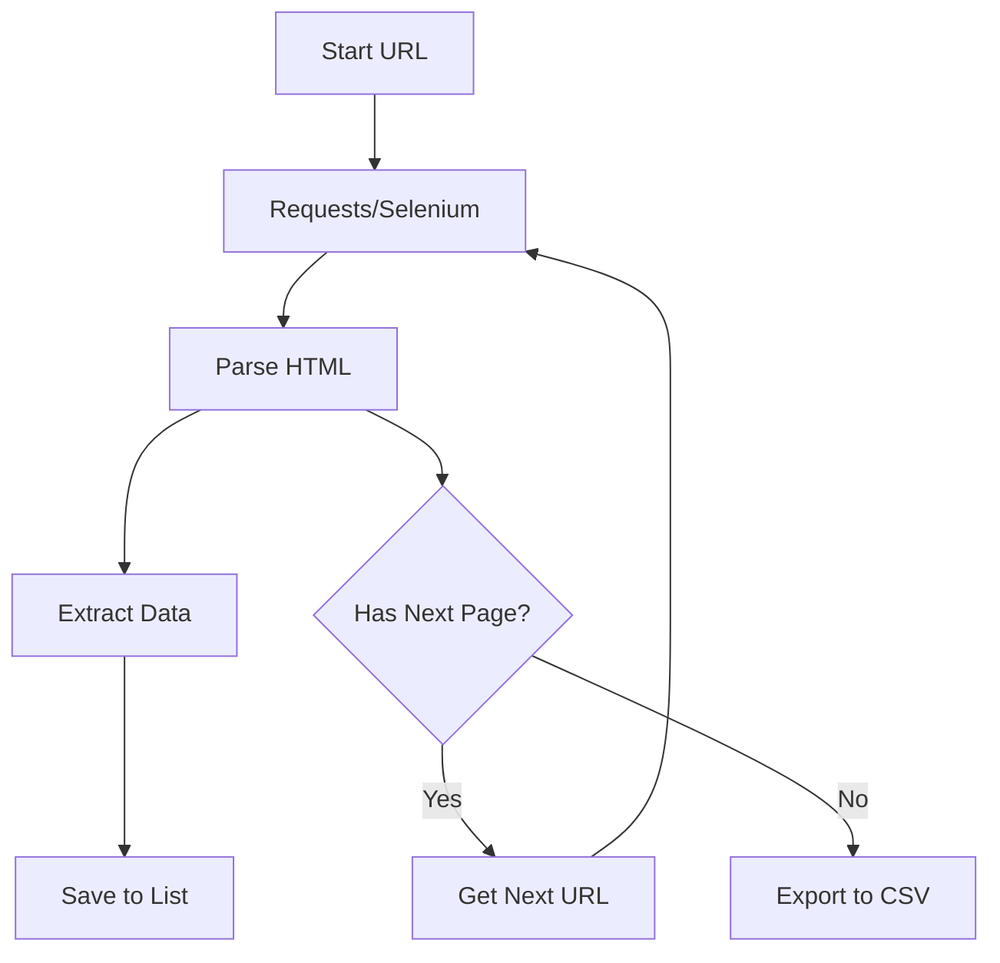

# 🕸️ Web Scraping Tutorial (Advanced)

<div align="center">


**"Handling Dynamic Content and Pagination"**

</div>

---

## 🎯 Objective
บทเรียนขั้นสูงสำหรับการดึงข้อมูลจากเว็บไซต์ที่มีความซับซ้อน (Dynamic Web Pages) ที่ใช้ JavaScript หรือมีการแบ่งหน้า (Pagination)

## 🏗️ Scraping Strategy



## 💻 Code Logic
```python
# Pagination handling
while next_button:
    scrape_current_page()
    click_next_page()
    time.sleep(2) # Respect server rate limit
```
