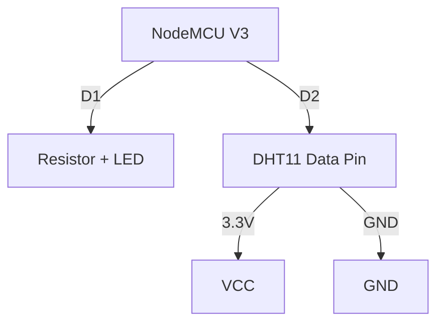

# 📟 IoT Lab 3: Sensor Integration

<div align="center">


**"Reading Environmental Data & Digital Output"**

</div>

---

## 🎯 Objective
เรียนรู้การเชื่อมต่อ Sensor พื้นฐาน (DHT11) เพื่อวัดอุณหภูมิ/ความชื้น และแสดงสถานะผ่านหลอดไฟ LED

## 🔌 Circuit Connection



## 💻 Code Logic
```cpp
// อ่านค่า DHT11 และสั่งงาน LED
float t = dht.readTemperature();
if (t > 30.0) {
  digitalWrite(LED_PIN, HIGH); // ร้อนเกินไป เปิดไฟเตือน
} else {
  digitalWrite(LED_PIN, LOW);
}
```

## 💡 Key Learnings
- **Digital I/O**: การใช้ `digitalRead` และ `digitalWrite`
- **Library Manager**: การติดตั้ง Library เสริม (DHT sensor library by Adafruit)
