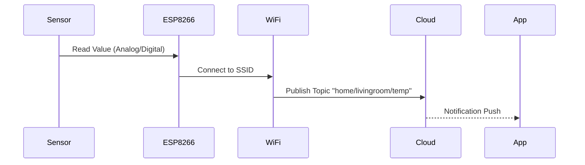

# 📡 IoT Lab 4-5: Network Communication

<div align="center">


**"Connecting Things to the Internet"**

</div>

---

## 🎯 Objective
ก้าวเข้าสู่โลกของ IoT อย่างแท้จริงด้วยการส่งข้อมูลขึ้น Cloud Platform และควบคุมอุปกรณ์ผ่าน Internet

## 🏗️ Data Transmission Flow



## 💻 Code Structure
การเชื่อมต่อ WiFi และ MQTT Broker
```cpp
void setup_wifi() {
  WiFi.begin(ssid, password);
  while (WiFi.status() != WL_CONNECTED) {
    delay(500);
    Serial.print(".");
  }
}
```

## 💡 Key Learnings
- **IoT Protocols**: ความแตกต่างระหว่าง HTTP (Request/Response) และ MQTT (Publish/Subscribe)
- **Latency**: ความล่าช้าในการส่งข้อมูลผ่านเครือข่าย
