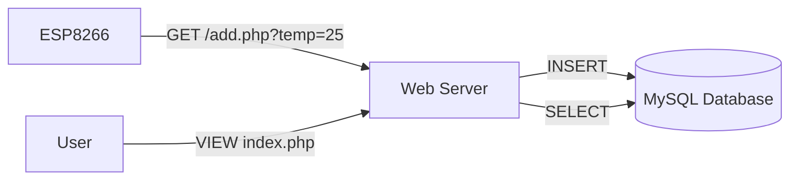

# 🌐 IoT Lab 4: Web Receiver Interface

<div align="center">


**"Backend API for IoT Data Collection"**

</div>

---

## 🎯 Objective
ส่วนนี้คือ **Backend Server** ที่คอยรับค่า HTTP GET Request จากบอร์ด ESP8266 และบันทึกลง Database พร้อมหน้าเว็บสำหรับแสดงผลข้อมูลย้อนหลัง

## 🏗️ Data Flow



## 📂 File Structure
- `add.php`: API Endpoint สำหรับรับค่าจาก Sensor
- `connectDB.php`: ไฟล์เชื่อมต่อฐานข้อมูล
- `index.php`: Dashboard แสดงทารางข้อมูล

## 💻 Code Logic (add.php)
```php
$temp = $_GET['temp'];
$sql = "INSERT INTO weather_log (temperature) VALUES ('$temp')";
mysqli_query($conn, $sql);
```
