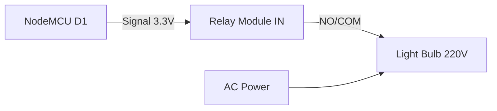

# 🔌 IoT Lab 5: Relay & High Power Control

<div align="center">


**"Controlling AC/DC Appliances safely"**

</div>

---

## 🎯 Objective
เรียนรู้วิธีการควบคุมอุปกรณ์ไฟฟ้ากระแสสลับ (AC 220V) หรืออุปกรณ์ที่ใช้กระแสสูง ผ่าน **Relay Module** โดยสั่งงานจาก Microcontroller (3.3V Logic)

## 🔌 Circuit Diagram



## 💻 Logic Control
Relay ทำงานแบบ **Active Low** หรือ **Active High** ขึ้นอยู่กับ Module

```cpp
// Example: Active Low Relay
#define RELAY_PIN D1

void setup() {
  pinMode(RELAY_PIN, OUTPUT);
  digitalWrite(RELAY_PIN, HIGH); // OFF state
}

void loop() {
  digitalWrite(RELAY_PIN, LOW); // ON (Pull Down)
  delay(1000);
  digitalWrite(RELAY_PIN, HIGH); // OFF
  delay(1000);
}
```

## ⚠️ Safety First
- **Isolation**: Relay ช่วยแยกวงจรไฟฟ้าแรงสูงออกจาก MCU อย่างสมบูรณ์ (Galvanic Isolation)
- **Warning**: ระมัดระวังไฟดูดเมื่อทำงานกับไฟบ้าน 220V
