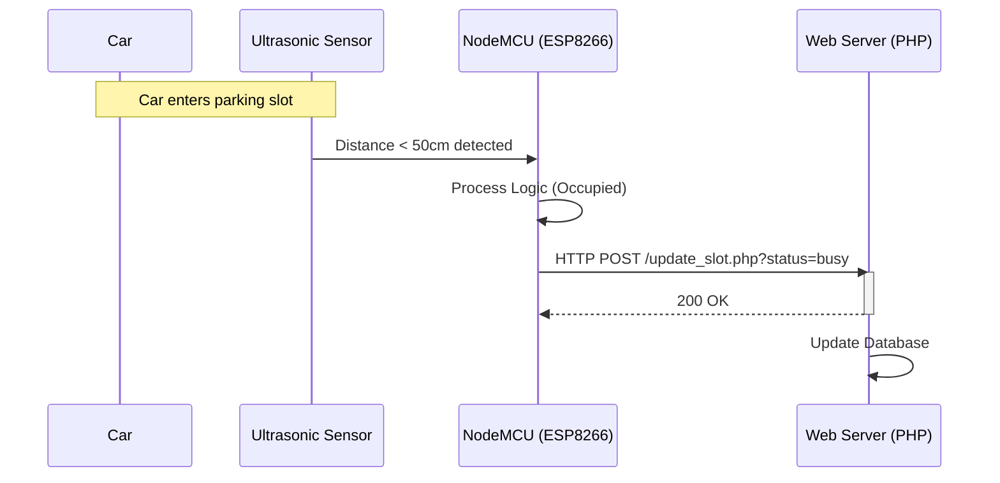

# 📡 IoT & Embedded Systems

**"Bridging the Gap Between Physical World and Digital Data"**

---

## 🎯 Problem Statement
ในยุค Smart City การนำข้อมูลจากโลกจริง (เช่น จำนวนรถในลานจอด) ขึ้นสู่ระบบออนไลน์แบบ Real-time เป็นสิ่งสำคัญ ความท้าทายคือ **Latency** ของเครือข่าย และ **Resource Constraint** ของ Microcontroller ที่มีหน่วยความจำจำกัด

## 🏗️ System Architecture (Smart Parking)

การเชื่อมต่อเซ็นเซอร์ Ultrasonic เข้ากับ ESP8266 เพื่อส่งข้อมูลผ่าน WiFi ไปยัง Web Server

## 📂 Project Showcase

### 1. 🅿️ Smart Parking System (`/IoT/final`)
*ระบบลานจอดรถอัจฉริยะ*
- **Components:** NodeMCU V3, Ultrasonic SR04, LCD I2C
- **Flow:** วัดระยะทาง -> คำนวณว่าง/ไม่ว่าง -> ส่งขึ้น Server -> แสดงผลบนเว็บ

### 2. 🏠 Smart Home Prototype
*ระบบเปิด-ปิดไฟผ่าน WiFi*
- **Components:** Relay Module, ESP8266
- **Flow:** ควบคุมเครื่องใช้ไฟฟ้าผ่าน Mobile Web App

## 💡 Key Learnings
- **Hardware Interrupts:** การใช้ Interrupt แทน Polling เพื่อการตอบสนองที่รวดเร็ว
- **Communication Protocols:** ความแตกต่างระหว่าง UART, I2C, และ SPI
- **Power Management:** การเขียนโค้ดให้ประหยัดพลังงานสำหรับอุปกรณ์ IoT

---

## 🚀 How to Run
1. **Hardware:** ต่อวงจรตาม Schematic (ดูในโฟลเดอร์)
2. **Firmware:** เปิดไฟล์ `.ino` ด้วย **Arduino IDE**
3. **Libraries:** ติดตั้ง Library ที่จำเป็น (เช่น `ESP8266WiFi`, `LiquidCrystal_I2C`)
4. **Upload:** เลือก Board และ Port ให้ถูกต้อง แล้วกด Upload
