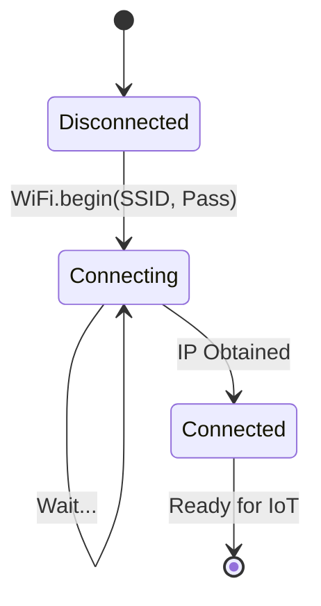

# 📡 IoT Workshop 1: WiFi Station Mode

<div align="center">


-blue?style=for-the-badge)

**"First Step to Internet of Things"**

</div>

---

## 🎯 Objective
การเชื่อมต่อ ESP8266 เข้ากับ WiFi บ้าน (Station Mode) เพื่อให้สามารถออกสู่อินเทอร์เน็ตได้ เป็นพื้นฐานสำคัญก่อนจะส่งข้อมูลขึ้น Cloud

## 🏗️ Connection State



## 💻 Code Structure
```cpp
#include <ESP8266WiFi.h>

void setup() {
  WiFi.mode(WIFI_STA); // Set as Station
  WiFi.begin("MyWiFi", "Password1234");
  
  while (WiFi.status() != WL_CONNECTED) {
    delay(500);
    Serial.print(".");
  }
  Serial.println(WiFi.localIP());
}
```

## 💡 Key Learnings
- **Station (STA) vs Access Point (AP)**: Workshop นี้ใช้ STA mode (เกาะ WiFi อื่น) ต่างจาก AP mode (ปล่อย WiFi เอง)
- **Serial Monitor**: การใช้ Serial เพื่อ Debug ดูสถานะการเชื่อมต่อ
