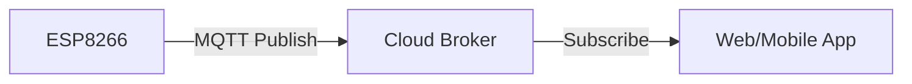

# ☁️ IoT Workshop 2: Send Data to NETPIE/Platform

<div align="center">


**"Visualize Sensor Data on Cloud Dashboard"**

</div>

---

## 🎯 Objective
การส่งข้อมูลขึ้น Cloud Platform (ในที่นี้อาจใช้ NETPIE, Blynk, หรือ Custom Server) เพื่อแสดงผลบน Dashboard แบบ Real-time

## 🏗️ Architecture



## 💻 Key Config
```cpp
#define MQTT_HOST "broker.netpie.io"
#define MQTT_CLIENT_ID "YOUR_CLIENT_ID"
#define MQTT_TOKEN "YOUR_TOKEN"
```
