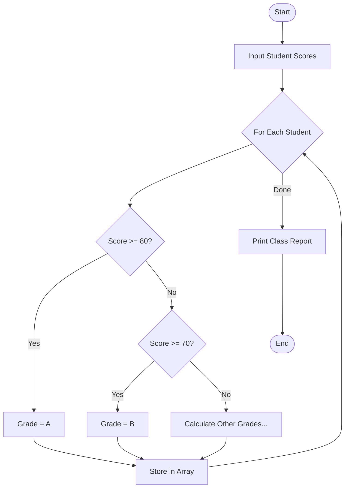

# 📊 Student Grading System

<div align="center">


**"Automated Score Calculation & Reporting"**

</div>

---

## 🎯 Objective
ระบบคำนวณเกรดนักศึกษาอัตโนมัติ รองรับการประมวลผลข้อมูลจำนวนมาก (Batch Processing) และแสดงผลรายงานสรุปทางสถิติของห้องเรียน

## 🏗️ Logic Flowchart



## � Tech Implementation
การใช้ **Array** เพื่อเก็บข้อมูลและ Loop เพื่อประมวลผล

```java
// Grade Calculation Logic
public char calculateGrade(int score) {
    if (score >= 80) return 'A';
    else if (score >= 70) return 'B';
    else if (score >= 60) return 'C';
    else if (score >= 50) return 'D';
    else return 'F';
}
```

## 💡 Key Learnings
- **Control Flow**: การใช้ if-else ladder ในการตัดสินใจช่วงคะแนน
- **Data Aggregation**: การคำนวณค่าเฉลี่ย (Average) และหาค่า Max/Min ของข้อมูลใน Array
