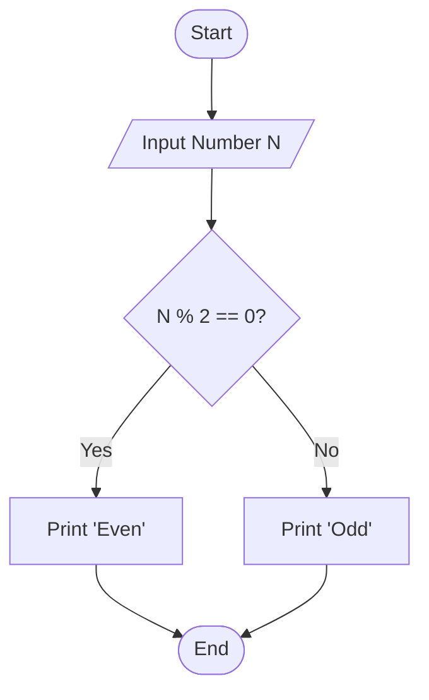

# 🧠 Java Logic & Math Algorithms

<div align="center">


**"Strengthening Computational Thinking with Java"**

</div>

---

## 🎯 Problem Statement
ก่อนจะสร้างระบบที่ซับซ้อน Programmer ต้องแม่นยำในตรรกะพื้นฐาน (Control Flow) และคณิตศาสตร์ Lab นี้รวบรวมโจทย์ฝึกสมอง เช่น การหาตัวหารร่วม, การเช็คเลขคู่/คี่, และสถิติ

## 🏗️ Logic Flowchart

อัลกอริทึมตรวจสอบเลขคู่-คี่ (Even/Odd Logic)



## 💻 Code Examples

### 1. Modulo Operator (%)
ใช้หาเศษจากการหาร เพื่อแยกแยะ Pattern ของตัวเลข
```java
if (number % 2 == 0) {
    System.out.println("Even Number");
} else {
    System.out.println("Odd Number");
}
```

### 2. Loop & Summation
หาผลรวมตัวเลข 1 ถึง N
```java
int sum = 0;
for (int i = 1; i <= n; i++) {
    sum += i;
}
```

## 💡 Key Learnings
- **Algorithm Complexity**: เข้าใจการทำงานของ O(1) vs O(n) ผ่าน Loop
- **Data Types**: การเลือกใช้ `int` vs `double` ให้เหมาะสมกับโจทย์
