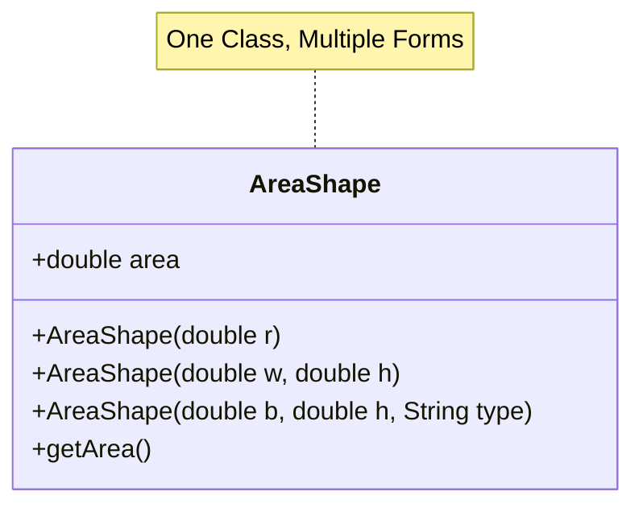

# 📐 OOP Shapes (Polymorphism)

<div align="center">


**"Flexible Class Design with Constructors"**

</div>

---

## 🎯 Objective
เรียนรู้หลักการ **Polymorphism** (การพ้องรูป) ผ่านการทำ **Constructor Overloading** ซึ่งช่วยให้ Class เดียวสามารถสร้าง Object รูปทรงต่างๆ ได้หลายแบบโดยใช้ชื่ออ้างอิงเดิม

## 🏗️ Overloading Structure



## 💻 Code Implementation
```java
// 1. Circle Constructor
public AreaShape(double r) {
    this.area = Math.PI * r * r;
}

// 2. Rectangle Constructor
public AreaShape(double w, double h) {
    this.area = w * h;
}
```

## 💡 Key Learnings
- **Overloading**: การมี Method/Constructor ชื่อเดียวกันแต่ Parameter ต่างกัน
- **Code Reusability**: ลดการสร้าง Class ใหม่พร่ำเพรื่อ (เช่น `CircleClass`, `RectClass`) โดยรวบรวม Logic ไว้ที่เดียว
