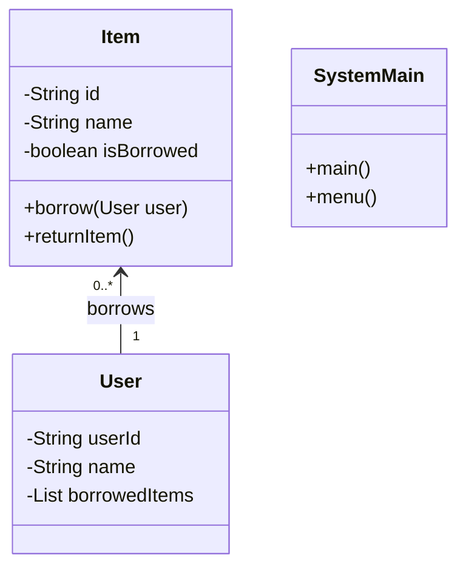

# 📚 Project Borrowing System

<div align="center">


**"Equipment Management Logic Implementation"**

</div>

---

## 🎯 Objective
ระบบจำลองการยืม-คืนอุปกรณ์ (Borrowing System) ฝึกการใช้ OOP (Encapsulation, Inheritance) เพื่อจัดการสถานะของสิ่งของและผู้ใช้งาน

## 🏗️ Class Diagram



## 💻 Code Structure
- **Main.java**: จุดเริ่มต้นของโปรแกรม (Entry Point) และ Menu Loop
- **Supermain.java**: คลาสหลักที่มี Logic การจัดการ Array ของอุปกรณ์

```java
// Logic การตรวจสอบสถานะอุปกรณ์
if (!item.isBorrowed()) {
    item.setBorrowed(true);
    System.out.println("Borrow Success!");
} else {
    System.out.println("Item is already borrowed.");
}
```

## 💡 Key Learnings
- **State Management**: การใช้ Boolean Flag (`isBorrowed`) เพื่อป้องกันการยืมซ้ำ
- **User Interface**: การออกแบบ CLI Menu ที่ใช้งานง่าย
