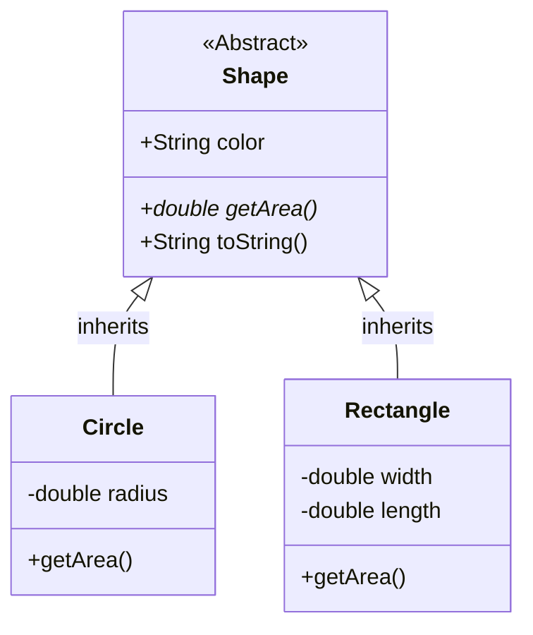

# ☕ Java Object-Oriented Programming

**"Building Scalable Systems with Strong Typing and Objects"**

---

## 🎯 Problem Statement
การเขียนโค้ดแบบ Procedural มักดูแลรักษายากเมื่อระบบใหญ่ขึ้น การใช้ **OOP (Object-Oriented Programming)** ช่วยให้เรามองโค้ดเป็นวัตถุที่มีหน้าที่ชัดเจน (Single Responsibility) และสามารถนำกลับมาใช้ใหม่ได้ (Reusability)

## 🏗️ Class Diagram Design

ตัวอย่างการออกแบบระบบรูปทรงเรขาคณิต (Polymorphism)

## 📂 Project Showcase

### 1. 📚 Borrowing System (Final Project)
*ระบบยืม-คืนอุปกรณ์สำนักงาน*
- **Concept:** ใช้ Abstract Class `Item` และสืบทอดเป็น `Book`, `Equipment`
- **Key Features:** Polymorphism ในการคำนวณค่าปรับที่ต่างกัน

### 2. 🔢 Grading Algorithm (`/Grading System`)
*ระบบตัดเกรดกลุ่มเรียน*
- **Concept:** Array Processing และ Statistical Calculation (Mean, SD)

## 💡 Key Learnings
- **Four Pillars of OOP:** เข้าใจลึกซึ้งใน Encapsulation, Abstraction, Inheritance, และ Polymorphism
- **Memory Management:** ความแตกต่างของ Stack vs Heap ใน Java

---

## 🚀 How to Run
1. **JDK Required:** Java 8+
2. **Compile:** `javac Main.java`
3. **Run:** `java Main`
