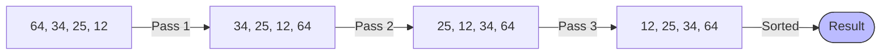

# 📶 Sorting Algorithms Demo

<div align="center">


**"Comparing Loop Structures in Sorting Logic"**

</div>

---

## 🎯 Objective
โปรแกรมสาธิตการทำงานของ **Bubble Sort** อัลกอริทึม โดยเปรียบเทียบการเขียน Loop Control 3 รูปแบบ (`for`, `while`, `do-while`) เพื่อเข้าใจพฤติกรรมการวนซ้ำที่แตกต่างกัน

## 🏗️ Bubble Sort Visualization



## 💻 Code Comparison
การสลับค่า (Swapping) เป็นหัวใจสำคัญของ Bubble Sort

```java
// Swapping Logic
if (arr[j] > arr[j+1]) {
    int temp = arr[j];
    arr[j] = arr[j+1];
    arr[j+1] = temp;
}
```

## 💡 Key Learnings
- **Time Complexity**: Bubble Sort มีความซับซ้อนระดับ O(n²) ซึ่งช้าแต่เข้าใจง่าย
- **Loop Control**: `for` เหมาะกับรู้จำนวนรอบ, `while` เหมาะกับเงื่อนไข
