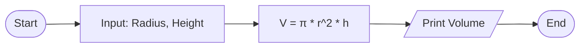

# 🧮 Dart Algorithmic Foundations (Assignment 1)

<div align="center">


**"Implementing Physics & Math Formulas in Dart"**

</div>

---

## 🎯 Problem Statement
การเริ่มต้นเขียนโปรแกรมด้วยภาษาใหม่ต้องเริ่มจากการจัดการ **Variables** และ **Data Types** อย่างถูกต้อง โจทย์ชุดนี้เน้นการแปลงสูตรคณิตศาสตร์และฟิสิกส์ให้เป็น Logic ทางคอมพิวเตอร์

## 🏗️ Logic Flowchart

การคำนวณปริมาตรทรงกระบอก (Cylinder Volume)



## 📋 Challenge Set
1.  **Statistical Average**: คำนวณค่าเฉลี่ยของชุดตัวเลข (Mean)
2.  **Kinematics (Physics)**: คำนวณระยะทางจากสมการ $s = vt$
3.  **Geometry 3D**: คำนวณปริมาตรทรงกระบอกและพื้นที่ผิว

## 💻 Implementation Highlights

```dart
// Type Safety in Dart
const double PI = 3.14159;

double calculateCylinderVolume(double r, double h) {
  return PI * (r * r) * h;
}

void main() {
  print("Volume: ${calculateCylinderVolume(5.0, 10.0)}");
}
```

## 💡 Key Learnings
- **Static Typing**: ความสำคัญของการระบุชนิดตัวแปร `double` vs `int` เพื่อความแม่นยำ
- **Constants**: การใช้ `const` สำหรับค่าคงที่ทางคณิตศาสตร์
