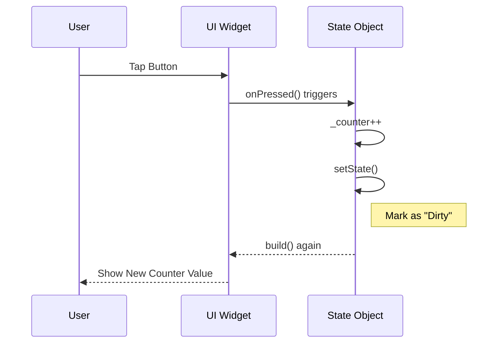

# 👆 Interactivity & State

<div align="center">


**"Handling Taps, Gestures, and Dynamic Updates"**

</div>

---

## 🎯 Problem Statement
Application ส่วนใหญ่ไม่ใช่แค่ Static UI แต่ต้องตอบสนองต่อผู้ใช้ได้ (Interactive) บทนี้เน้นการใช้ `StatefulWidget` เพื่อรับค่าจาก Input และอัปเดตหน้าจอทันที

## 🏗️ State Lifecycle

วงจรชีวิตของการอัปเดต UI ด้วย `setState()`



## 💻 Code Highlight
การใช้ `TextFieldController` รับค่าจาก Keyboard

```dart
final myController = TextEditingController();

@override
void dispose() {
  // Clean up the controller when the widget is disposed.
  myController.dispose();
  super.dispose();
}
```

## 💡 Key Learnings
- **Stateless vs Stateful**: เมื่อไหร่ควรใช้ `StatefulWidget` (คำตอบ: เมื่อ UI ต้องเปลี่ยนรูปร่างตามข้อมูล)
- **Controller Pattern**: การควบคุม Input Widget ผ่าน Controller Object
