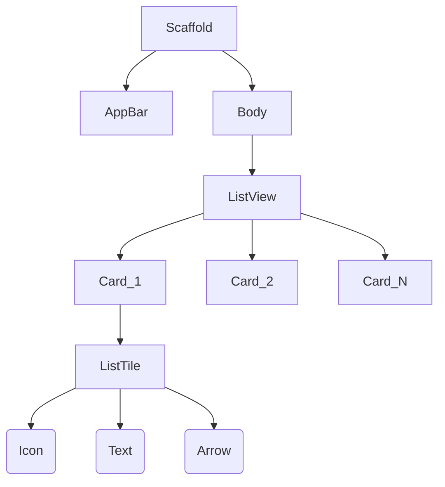

# 📲 Interactive Menu UI

**"Building Scrollable Lists and Touch Interactions"**

---

## 🎯 Problem Statement
การแสดงรายการข้อมูลจำนวนมาก (List) เป็น UI Pattern ที่พบบ่อยที่สุด โจทย์คือการสร้างเมนูที่เลื่อนได้ (Scrollable) และตอบสนองต่อการกด (Interactive) อย่างลื่นไหล

## 🏗️ Widget Tree Structure

โครงสร้างของหน้าจอ Menu

## 🛠️ Components
- **ListView.builder**: Widget สำหรับสร้าง List ที่มีประสิทธิภาพสูง (Render เฉพาะสิ่งที่เห็นบนจอ)
- **InkWell / GestureDetector**: เพิ่ม Ripple Effect และการตรวจจับการกด
- **Card**: ตกแต่งด้วยเงา (Elevation) และขอบโค้ง

## 💡 Key Learnings
- **Performance**: การใช้ `ListView.builder` แทน `ListView` ปกติเมื่อมีข้อมูลจำนวนมาก เพื่อลด Memory Usage
- **UX feedback**: ผู้ใช้ต้องรู้ว่ามีการกดปุ่มผ่าน Visual Feedback (สีเปลี่ยน/เงานูนขึ้น)
