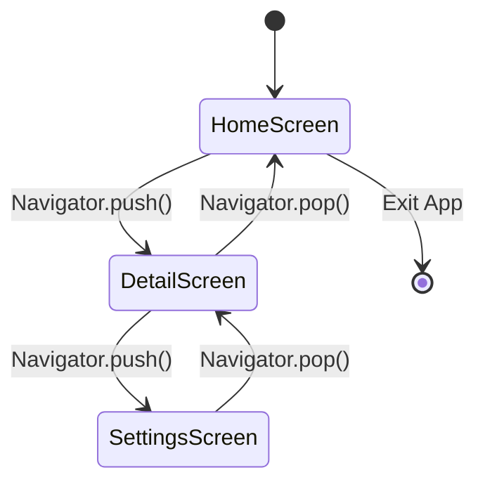

# 🧭 Flutter Navigation & Routing

<div align="center">


**"Managing Screen Transitions and Route Stack"**

</div>

---

## 🎯 Problem Statement
Application สมัยใหม่มีการทำงานหลายหน้าจอ (Multi-screen) ความท้าทายคือการจัดการประวัติการเข้าชม (History Stack) เพื่อให้ปุ่ม "Back" ทำงานได้อย่างถูกต้องตาม UX Standard

## 🏗️ Navigation State Diagram

การทำงานของ Stack เมื่อมีการเปลี่ยนหน้า



## 🛠️ Key Concepts
- **Route Stack**: โครงสร้างข้อมูลแบบ **LIFO (Last-In, First-Out)** ที่ใช้เก็บประวัติหน้าจอ
- **MaterialPageRoute**: การเปลี่ยนหน้าพร้อม Animation มาตรฐาน (Slide/Fade) ที่เหมาะสมกับ Platform (Android/iOS)

## 💻 Implementation Highlights

```dart
// Navigate to a new screen
GestureDetector(
  onTap: () {
    Navigator.push(
      context,
      MaterialPageRoute(builder: (context) => SecondRoute()),
    );
  },
  child: Text("Go to Details"),
)
```

## 💡 Key Learnings
- **Context**: ความสำคัญของ `BuildContext` ในการค้นหา Navigator Widget ใน Tree
- **Data Passing**: การส่ง Arguments ผ่าน Constructor ของ Widget ปลายทาง
