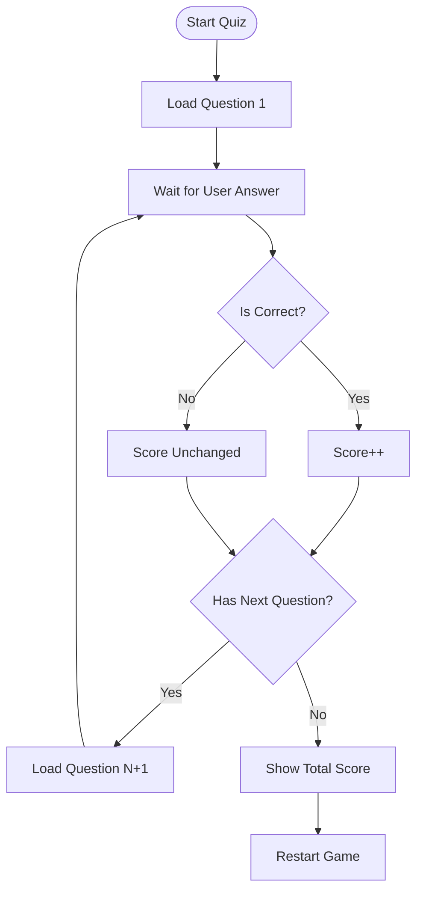

# ❓ Interactive Quiz Application

<div align="center">


**"State Management & Logic Implementation in Flutter"**

</div>

---

## 🎯 Problem Statement
การสร้างแบบทดสอบ (Quiz) ต้องมีการจัดการข้อมูลหลายส่วน: โจทย์, ตัวเลือก, เฉลย, และคะแนนรวม โจทย์คือการเชื่อมโยง Logic เหล่านี้เข้ากับ UI ที่เปลี่ยนไปทีละข้อ

## 🏗️ App Logic Flow



## 💻 Code Structure
การใช้ **Maps** เก็บข้อมูลคำถาม เพื่อให้ง่ายต่อการขยายจำนวนข้อ

```dart
final List<Map<String, Object>> questions = [
  {
    'questionText': 'What\s your favorite color?',
    'answers': [
      {'text': 'Black', 'score': 10},
      {'text': 'Red', 'score': 5},
    ],
  },
];
```

## 💡 Key Learnings
- **List & Map**: การใช้ Data Structure ที่ซับซ้อนเพื่อเก็บชุดคำถามแบบ Dynamic
- **Callback Functions**: การส่ง Function `answerQuestion()` ไปยัง Widget ลูกเพื่อให้กดปุ่มแล้วส่งผลกลับมาที่แม่
