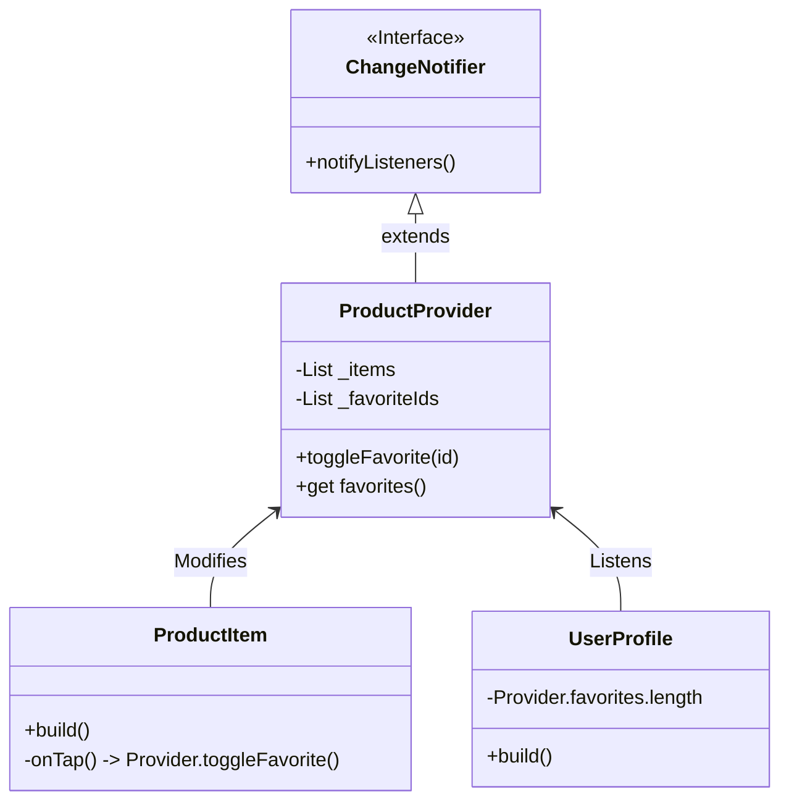

# 🛒 Advanced State Management (Provider)

<div align="center">


**"Scalable State Management for Complex Apps"**

</div>

---

## 🎯 Problem Statement
เมื่อแอปซับซ้อนขึ้น การส่งผ่านข้อมูลด้วย Constructor (Prop Drilling) จะยุ่งยากและดูแลยาก **Provider** ช่วยแก้ปัญหานี้โดยการสร้าง "ท่อส่งข้อมูล" ที่ Widget ไหนก็เจาะเข้าไปดึงข้อมูลได้ทันที

## 🏗️ State Architecture

โครงสร้างการแชร์สถานะ "รายการโปรด" (Favorites)



## 💻 Implementation Highlights

### 1. Provider Class (Logic)
```dart
class ProductProvider with ChangeNotifier {
  void toggleFavorite(String id) {
    // ... logic ...
    notifyListeners(); // แจ้งเตือน UI ให้รีเฟรช
  }
}
```

### 2. Consumer (UI)
```dart
Consumer<ProductProvider>(
  builder: (ctx, product, _) => Icon(
    product.isFavorite ? Icons.favorite : Icons.favorite_border,
  ),
),
```

## 💡 Key Learnings
- **Singleton Pattern**: Provider ทำหน้าที่คล้าย Singleton ที่เข้าถึงได้จากทุกที่ภายใต้ Context
- **Performance**: `notifyListeners()` จะ Re-build เฉพาะ Widget ที่ `listen: true` หรือใช้ `Consumer` เท่านั้น
