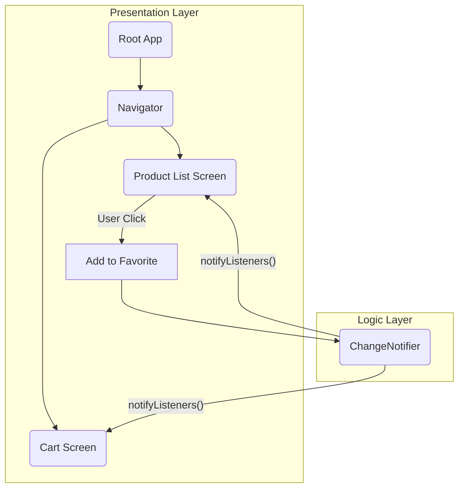

# 📱 Mobile Engineering (Flutter)

<div align="center">


**"High-Performance Native Interfaces with a Single Codebase"**

</div>

---

## 🎯 Problem Statement
การพัฒนาแอปพลิเคชันมือถือแบบ Native (iOS/Android) มักต้องใช้ทีมพัฒนาถึง 2 ทีมและดูแล Codebase 2 ชุด ความท้าทายคือการสร้าง **UI ที่ลื่นไหล** (60fps) และ **Business Logic** ที่ใช้ร่วมกันได้ โดยไม่ลดทอนประสิทธิภาพ

## 🏗️ Architecture & State Management

ใช้สถาปัตยกรรมแบบ **Reactive Programming** ร่วมกับ **Provider Pattern** เพื่อจัดการ State ของแอพพลิเคชัน



## 📂 Project Showcase

### 1. 🛒 Fruit Shop Store (State Management Workshop)
*หน้าร้านค้าออนไลน์บนมือถือ*
- **Concept:** การจัดการ Global State (รายการสินค้าที่ชอบ) ข้ามหน้าจอ
- **Tech Highlights:** `Provider`, `Consumer`, `ListView.builder`

### 2. 🧮 GPA Calculator
*แอพคำนวณเกรดเฉลี่ย*
- **Concept:** การรับ Input และคำนวณ Logic ที่ซับซ้อนแบบ Real-time
- **Tech Highlights:** Form Validation, Dynamic List Logic

### 3. 🔐 Authentication System
*ระบบ Login/Register*
- **Concept:** การจัดการ TextField และการตรวจสอบความถูกต้องของข้อมูล
- **Tech Highlights:** `TextEditingController`, Secure Storage basics

## 💡 Key Learnings (Flutter)
- **Declarative UI:** การสร้าง UI โดยการประกาศสถานะ (State) แทนคำสั่ง (Imperative) ทำให้โค้ดอ่านง่ายและคาดเดาได้
- **Widget Tree:** ความเข้าใจเรื่อง `BuildContext` และการส่งข้อมูลลงสู่ Widget ลูก (InheritedWidget)
- **Asynchronous Dart:** การใช้ `Future` และ `Stream` ในการจัดการข้อมูลที่ไม่พร้อมใช้งานทันที

---

## 🚀 How to Run
1. **Prerequisites:** Flutter SDK ติดตั้งเรียบร้อย
2. **Get Packages:**
   ```bash
   flutter pub get
   ```
3. **Debug:**
   ```bash
   flutter run
   ```
   *Note: ตรวจสอบว่าเปิด Emulator หรือเสียบอุปกรณ์จริงแล้ว*
