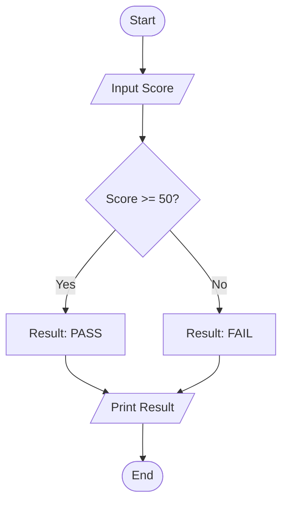

# 🐍 Python Scripting & Logic

<div align="center">


**"Mastering Logic, Automation, and Problem Solving"**

</div>

---

## 🎯 Problem Statement
พื้นฐานที่สำคัญที่สุดของโปรแกรมเมอร์คือ **Computational Thinking** การแปลงปัญหาในโลกจริงให้เป็นอัลกอริทึมที่คอมพิวเตอร์เข้าใจผ่านภาษาที่มี Syntax กระชับที่สุดอย่าง Python

## 🏗️ Logic Flowchart

ตัวอย่าง Logic การตัดเกรด (Conditionals)



## 📂 Project Showcase

### 1. 🎮 Logic Mini-Games
*รวมเกม Console-based ฝึกตรรกะ*
- **Assignments:** Pyramid Printing, Number Guessing, Currency Converter
- **Key Learnings:** Loop (`for`, `while`), Control Flow (`if-else`)

### 2. 🧮 Calculator Function
*ฟังก์ชันคำนวณทางคณิตศาสตร์*
- **Key Learnings:** Function Declaration, Return Values, Error Handling (`try-except`)

---

## 🚀 How to Run
1. **Install Python:** [python.org](https://www.python.org/)
2. **Execute:**
   ```bash
   python script_name.py
   ```
