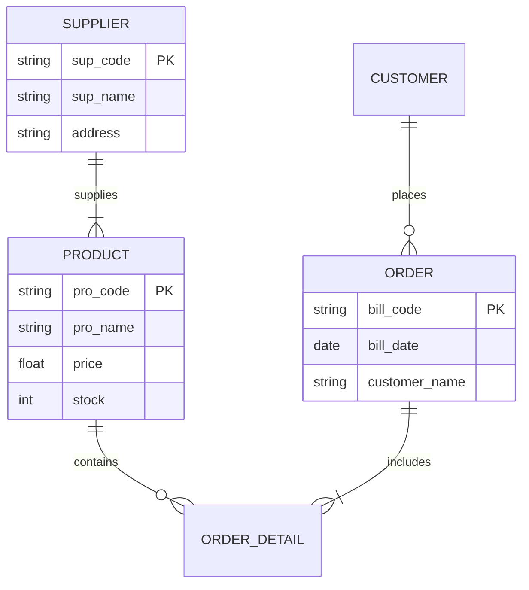

# 🗄️ SQL & Database Management

<div align="center">


**"Design, Optimize, and Secure Critical Business Data"**

</div>

---

## 🎯 Problem Statement
ระบบ Software ที่ดีต้องมีฐานข้อมูลที่ออกแบบมาอย่างถูกต้องเพื่อลดความซ้ำซ้อน (Redundancy) และรองรับการขยายตัว (Scalability) โจทย์คือการออกแบบ **ERD** ที่สอดคล้องกับ Business Requirements และการเขียน Query ที่มีประสิทธิภาพ

## 🏗️ Entity-Relationship Diagram (ERD)

โครงสร้างฐานข้อมูลร้านค้า (Supply Chain Management)



## 📂 Project Showcase

### 1. 🏪 Retail Database Schema (`/SQL`)
*ระบบฐานข้อมูลร้านค้าปลีก*
- **Features:**
  - **Normalization:** ออกแบบตามหลัก 3NF
  - **Backup Strategy:** สคริปต์สำรองข้อมูลรายสัปดาห์ (Full Backup)
  - **Complex Queries:** ตัวอย่างการใช้ `JOIN`, `GROUP BY`, และ `HAVING` เพื่อออกรายงานยอดขาย

## 💡 Key Learnings
- **ACID Properties:** ความสำคัญของ Atomicity, Consistency, Isolation, Durability ใน Transaction
- **Indexing:** การทำ Index เพื่อเพิ่มความเร็วในการ Search
- **Data Integrity:** การใช้ Foreign Key Constraints เพื่อป้องกันข้อมูลขยะ

---

## 🚀 How to Restore
1. **Requirements:** MySQL Server / MariaDB
2. **CLI Import:**
   ```bash
   mysql -u root -p nattapong51 < 2024.1.29.sql
   ```
3. **GUI Import:** ใช้ Tools เช่น **phpMyAdmin** หรือ **DBeaver** เลือกเมนู *Import* ไฟล์ `.sql` ล่าสุด
