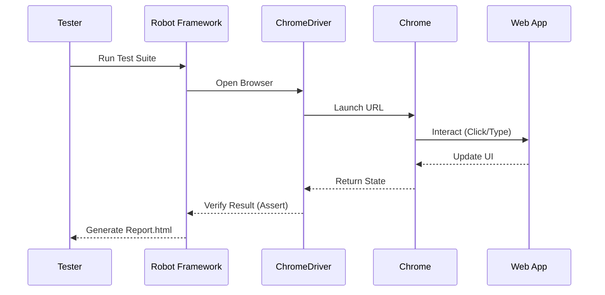

# 🤖 Robot Framework Automation

<div align="center">


**"Keyword-Driven Acceptance Testing"**

</div>

---

## 🎯 Objective
รวมชุด Automated Test Script ที่เขียนด้วย **Robot Framework** ซึ่งเป็น Keyword-Driven Testing Tool ที่อ่านง่ายเหมือนภาษาอังกฤษ ใช้ทดสอบ Web UI (Assignment Login, Facebook Register)

## 🏗️ Test Execution Flow



## 📂 Test Suites
1.  **Assignment (Login)**: ทดสอบ Workflow การล็อกอินที่ `the-internet.herokuapp.com`
2.  **Facebook Register**: ทดสอบกรอกฟอร์มสมัครสมาชิก (Demo)

## 💻 Code Example (.robot)
```robot
*** Test Cases ***
Valid Login
    Open Browser    ${URL}    chrome
    Input Text      id=username    tomsmith
    Input Password  id=password    SuperSecretPassword!
    Click Button    css=button[type='submit']
    Element Should Contain    id=flash    You logged into a secure area!
    [Teardown]    Close Browser
```
