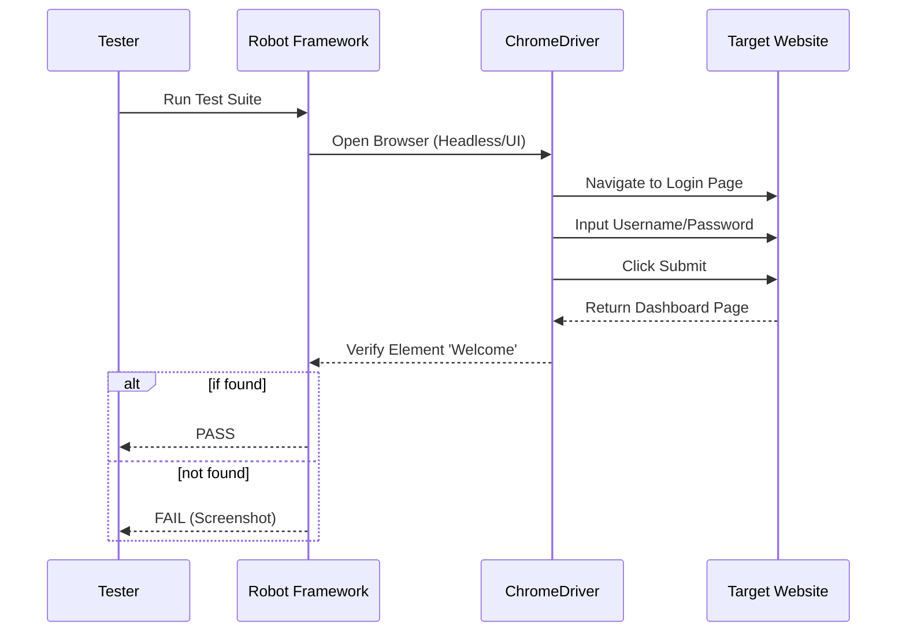

# 🧪 QA & Automated Testing

<div align="center">


**"Ensuring Software Reliability Through Automation"**

</div>

---

## 🎯 Problem Statement
การทดสอบด้วยมือ (Manual Testing) ใช้เวลานานและเกิดความผิดพลาดได้ง่าย โดยเฉพาะการทำ Regression Test ก่อนขึ้นระบบจริง โจทย์คือการสร้าง **Automated Test Suite** ที่สามารถรันซ้ำได้ตลอดเวลาเพื่อตรวจสอบฟังก์ชันหลัก (Critical Path)

## 🏗️ Test Process Flow

การทำงานของ Robot Framework ผ่าน Web Browser



## 📂 Project Showcase

### 1. 🤖 Facebook Login Automation (`/Katalon Reorder`)
*ระบบทดสอบการเข้าสู่ระบบ*
- **Scenario:** ตรวจสอบการ Login ทั้งกรณี Success และ Failed
- **Tech Highlights:**
  - **Keyword-Driven:** เขียน Test Case เป็นภาษามนุษย์ (Gherkin syntax-like)
  - **Variables:** การจัดการ Test Data แยกจาก Logic

## 💡 Key Learnings
- **Selectors:** ความสำคัญของ XPath และ CSS Selector ที่แข็งแรง (Robust) ไม่เปราะบางต่อการเปลี่ยน UI
- **Wait Strategies:** การใช้ `Wait Until Element Is Visible` แทน `Sleep` เพื่อลดเวลาการรัน Test

---

## 🚀 How to Run
1. **Prerequisites:** Python 3.8+, Chrome Browser
2. **Install:**
   ```bash
   pip install robotframework robotframework-seleniumlibrary
   chromedriver-autoinstaller
   ```
3. **Execute:**
   ```bash
   robot tests/login_test.robot
   ```
