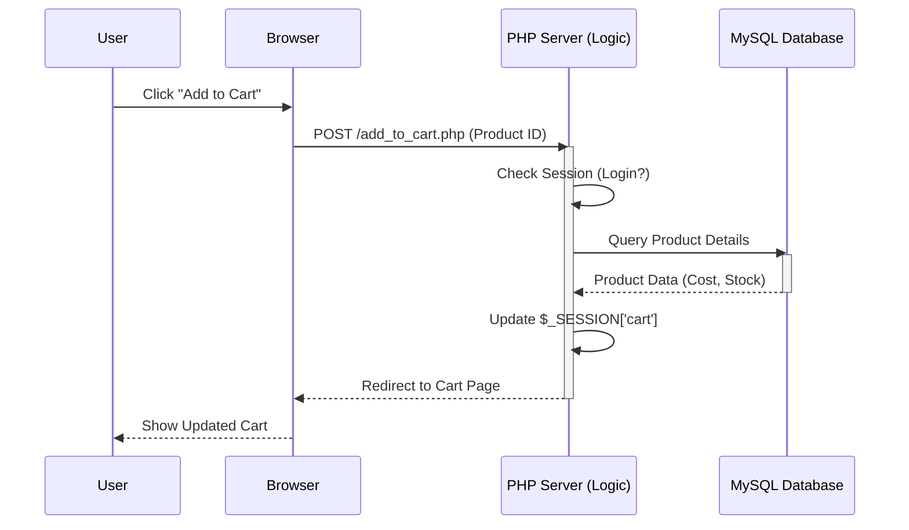

# 🌐 Web Engineering & Architecture

<div align="center">


**"From Static Designs to Dynamic Data-Driven Applications"**

</div>

---

## 🎯 Problem Statement
การพัฒนาเว็บแอปพลิเคชันที่มีความซับซ้อน (เช่น ระบบ E-Commerce) ต้องการโครงสร้างที่ชัดเจนในการจัดการข้อมูล (Data Integrity), ความปลอดภัย (Security), และประสบการณ์ผู้ใช้ (UX) สิ่งที่ท้าทายคือการจัดการ **Session State** (เช่น ตะกร้าสินค้า) และการออกแบบฐานข้อมูลให้รองรับการขยายตัว

## 🏗️ Solution Architecture (Web/php/final)

โปรเจกต์นี้ใช้สถาปัตยกรรมแบบ **Model-View-Controller (MVC)** อย่างง่าย โดยแยก Business Logic (PHP) ออกจาก Presentation (HTML) และ Data Access (SQL)



## 📂 Project Showcase

### 1. 🛍️ E-Commerce System (`/Web/php/final`)
*ร้านขายอุปกรณ์คอมพิวเตอร์ครบวงจร*
- **Key Features:**
  - **Session Management:** ระบบตะกร้าสินค้าที่จดจำสินค้าข้ามหน้า
  - **Role-Based Access:** แผงควบคุมสำหรับ Admin (จัดการสินค้า/User) และ User (ซื้อของ)
  - **CRUD Operations:** เพิ่ม-ลบ-แก้ไข สินค้าและหมวดหมู่

### 2. 🏫 University Management (`/Web/php/project6`)
*ระบบจัดการข้อมูลมหาวิทยาลัย*
- **Key Features:**
  - การเชื่อมต่อฐานข้อมูลหลายตาราง (JOINs)
  - การจัดการข้อมูลนักศึกษา และรายวิชา

## 💡 Key Learnings
- **Stateless vs Stateful:** HTTP เป็น Stateless protocol จึงต้องใช้ Session/Cookies มาช่วยในการจำ user state
- **Security First:** การป้องกัน SQL Injection โดยใช้ Prepared Statements และการ Hashing รหัสผ่าน
- **Database Normalization:** การออกแบบ 3NF เพื่อลดความซ้ำซ้อนของข้อมูล

---

## 🚀 How to Run
1. **Requirements:** web Server (Apache/Nginx), PHP 7.4+, MySQL
2. **Setup Database:** Import ไฟล์ `.sql` จากโฟลเดอร์ `SQL/` (ถ้ามี) หรือใช้คำสั่งใน `db.php`
3. **Config:** แก้ไขค่าเชื่อมต่อ Database ใน `db.php`
   ```php
   $conn = mysqli_connect("localhost", "root", "", "shop_db");
   ```
4. **Deploy:** วางไฟล์ใน `htdocs` แล้วเปิด Browser ไปที่ `http://localhost/Web/php/final/`
