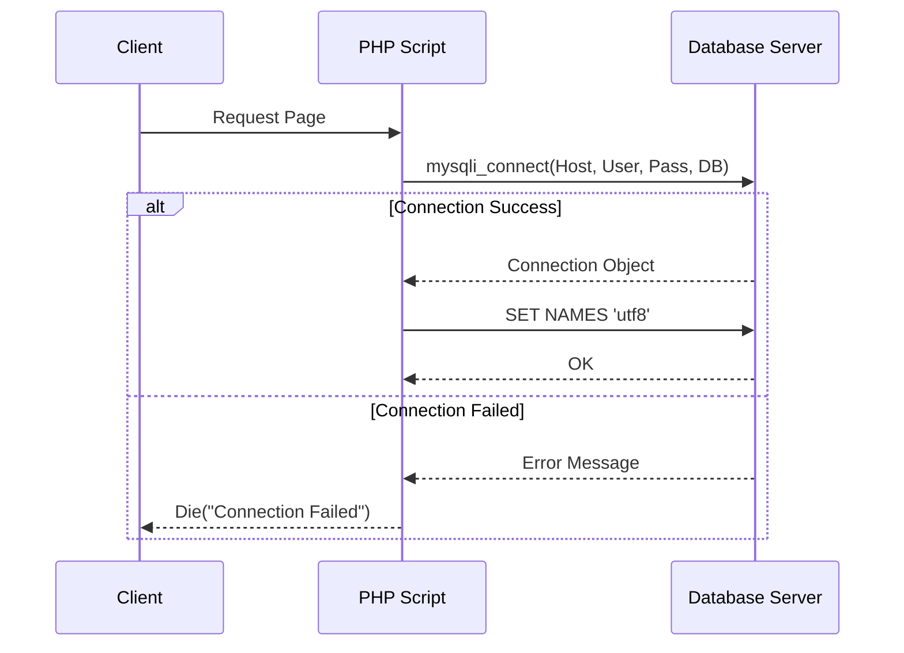

# 🔌 MySQL Database Connection

<div align="center">


**"Establishing Secure Connection to Relational Database"**

</div>

---

## 🎯 Problem Statement
หัวใจของ Web Application คือข้อมูล การเชื่อมต่อระหว่าง PHP (Server) และ MySQL (Database) เป็นด่านแรกที่สำคัญ จำเป็นต้องจัดการเรื่อง **Encoding (UTF-8)** และ **Error Handling** ให้ถูกต้อง

## 🏗️ Connection Flow



## 💻 Implementation Highlights

```php
// Standard Connection Pattern
$conn = mysqli_connect("localhost", "root", "", "my_db");

// Check Connection
if (!$conn) {
    die("Connection failed: " . mysqli_connect_error());
}

// Support Thai Language
mysqli_set_charset($conn, "utf8");
```

## 💡 Key Learnings
- **MySQLi Extension**: การใช้ Driver รุ่นปรับปรุง (Improved) แทน mysql เดิมที่เลิกใช้แล้ว
- **Character Set**: การตั้งค่า `utf8` เพื่อป้องกันปัญหาภาษาต่างดาว (Mojibake)
