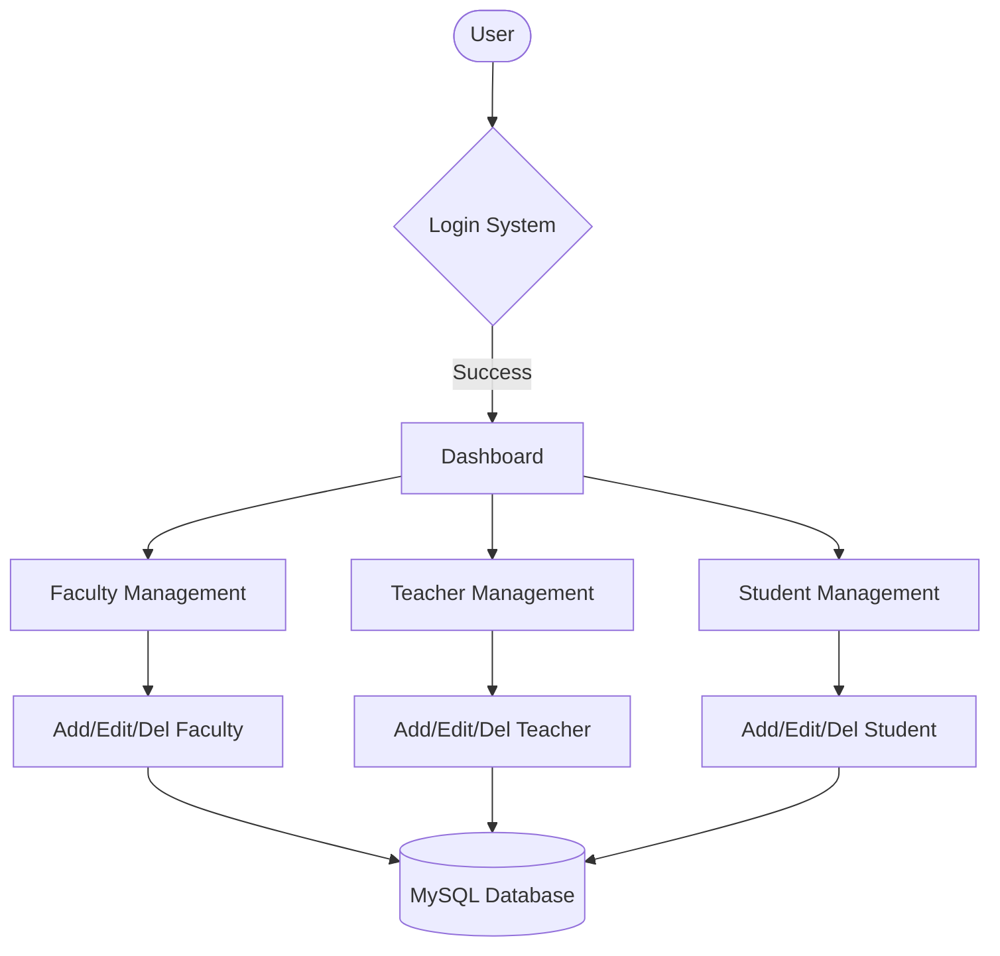

# 🎓 University Management System (Final Project)

<div align="center">


**"Complete CRUD System for Teacher & Student Records"**

</div>

---

## 🎯 Project Overview
ระบบสารสนเทศมหาวิทยาลัยที่ครอบคลุมการจัดการข้อมูลหลัก 3 ส่วน: **คณะ (Faculty)**, **อาจารย์ (Teacher)**, และ **นักศึกษา (Student)** โดยมีการแบ่งสิทธิ์การเข้าถึง (Admin/User)

## 🏗️ System Architecture



## 🗂️ Key Features
- **Search System**: ระบบค้นหาอัจฉริยะที่กรองข้อมูลได้หลายเงื่อนไข
- **Reporting**: หน้าสรุปรายงานข้อมูล (Report Pages)
- **Security**: การเข้ารหัสรหัสผ่านและการตรวจสอบ Session

## 💻 Tech Implementation
- **Relational Database**: การเชื่อมตารางด้วย Foreign Key (Fac_ID)
- **Bootstrap 5**: ใช้ Framework เพื่อความสวยงามและ Responsive

```php
// SQL Join Example
$sql = "SELECT student.*, faculty.fac_name 
        FROM student 
        INNER JOIN faculty ON student.fac_id = faculty.fac_id";
```
