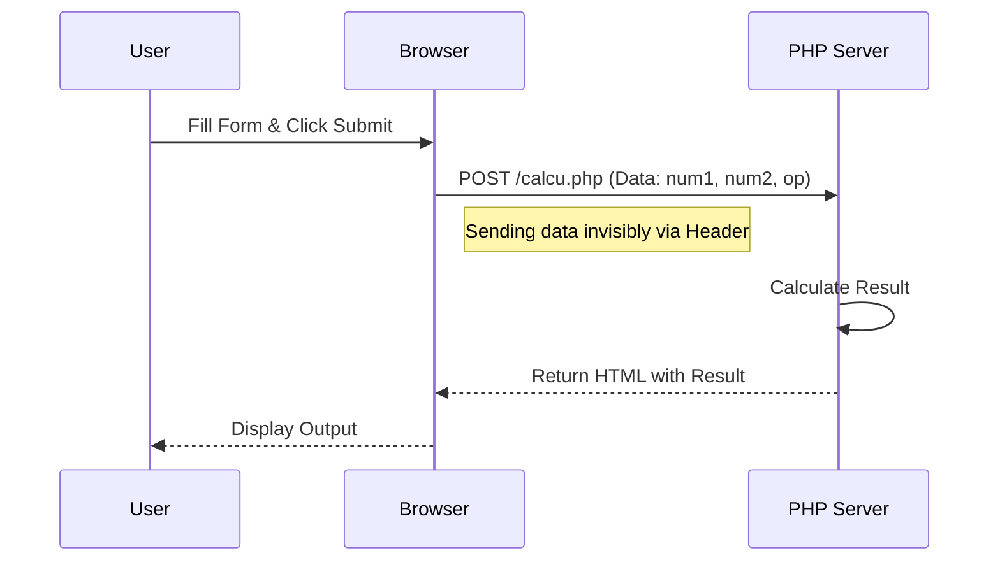

# 📝 PHP Form Handling & Processing

<div align="center">


**"Interacting with Users: GET vs POST"**

</div>

---

## 🎯 Problem Statement
Web Application ต้องสื่อสารกับผู้ใช้ผ่านหน้าจอ (Frontend) และส่งข้อมูลไปประมวลผล (Backend) ความเข้าใจเรื่อง **HTTP Request Methods** เป็นพื้นฐานสำคัญในการเลือกใช้วิธีส่งข้อมูลให้เหมาะสมกับความปลอดภัย

## 🏗️ Data Flow Diagram

การส่งข้อมูลจาก Form ไปยัง Script คำนวณ



## 💻 Tech Implementation
- **$_POST**: ตัวแปร Superglobal สำหรับรับข้อมูลแบบปลอดภัย (ไม่โชว์บน URL) เหมาะกับการส่งรหัสผ่านหรือการคำนวณ
- **$_GET**: สำหรับรับข้อมูลผ่าน URL เหมาะกับการทำ Search หรือ Link

### Code Snippet (`calcu.php`)
```php
$num1 = $_POST['num1'];
$num2 = $_POST['num2'];
$operator = $_POST['operator'];

switch ($operator) {
    case '+': $result = $num1 + $num2; break;
    case '-': $result = $num1 - $num2; break;
    // ...
}
```

## 💡 Key Learnings
- **Security**: ทำไมแบบฟอร์มที่มีข้อมูลสำคัญจึง **ห้าม** ใช้ GET เด็ดขาด
- **Input Validation**: การตรวจสอบ `isset()` ก่อนเรียกใช้ตัวแปรเพื่อป้องกัน Error
