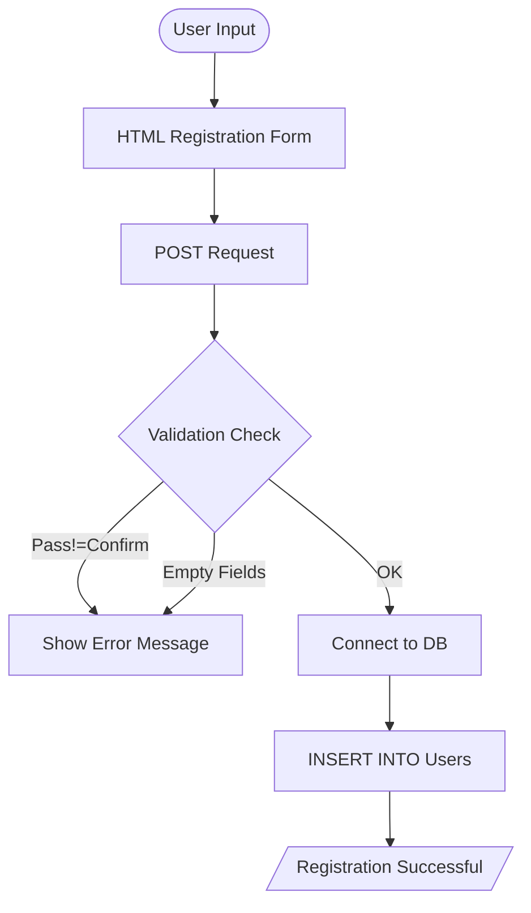

# 📋 Membership Registration System

<div align="center">


**"Secure User Input & Data Verification"**

</div>

---

## 🎯 Problem Statement
การรับข้อมูลผู้ใช้ (Registration) เป็นจุดเริ่มต้นของระบบสมาชิก ความท้าทายคือการตรวจสอบความถูกต้องของข้อมูล (Validation) เช่น รหัสผ่านต้องตรงกัน (Confirm Password) และอีเมลถูกต้อง

## 🏗️ Data Processing Flow



## 💻 Code Highlights
```php
// Password Matching Validation
if ($_POST['password'] !== $_POST['confirm_password']) {
    die("Error: Passwords do not match!");
}

// SQL Injection Prevention (Basic)
$username = mysqli_real_escape_string($conn, $_POST['username']);
```

## 💡 Key Learnings
- **Form Validation**: ความสำคัญของการตรวจสอบข้อมูลฝั่ง Server (Server-side Validation)
- **UX**: การแจ้งเตือนผู้ใช้เมื่อกรอกข้อมูลผิดพลาด
