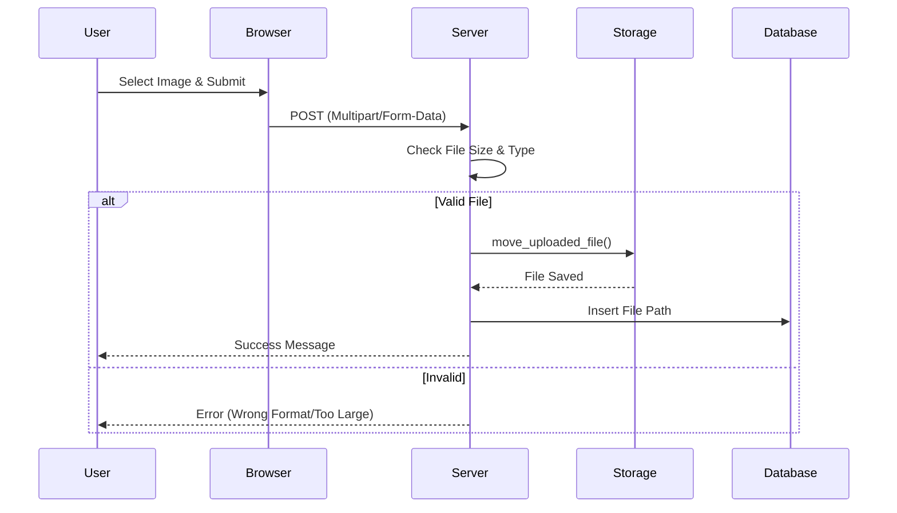

# 🖼️ Gallery & File Upload System

<div align="center">


**"Managing User-Generated Content & Image Assets"**

</div>

---

## 🎯 Problem Statement
การอนุญาตให้ผู้ใช้อัปโหลดไฟล์ (File Upload) มีความซับซ้อนกว่าข้อมูลตัวอักษร ต้องจัดการเรื่อง **Permissions**, **Unique Filenames**, และ **File Types** เพื่อความปลอดภัย

## 🏗️ Upload Process



## 💻 Tech Implementation
- **enctype="multipart/form-data"**: Attribute จำเป็นสำหรับ Form อัปโหลดไฟล์
- **tmp_name**: การจัดการไฟล์ชั่วคราวก่อนย้ายไปยังโฟลเดอร์จริง

```php
$target_dir = "uploads/";
$target_file = $target_dir . basename($_FILES["fileToUpload"]["name"]);
move_uploaded_file($_FILES["fileToUpload"]["tmp_name"], $target_file);
```

## 💡 Key Learnings
- **Security Risk**: ทำไมต้องตรวจสอบนามสกุลไฟล์ป้องกันการอัปโหลดไฟล์ `.php` (Shell Upload)
- **Directory Permissions**: การตั้งค่า Folder ให้เขียนข้อมูลได้ (Write Permission)
