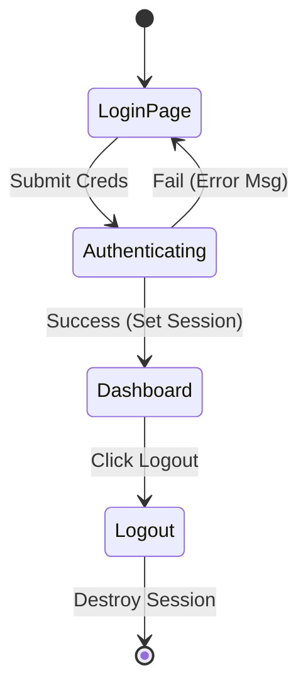

# 🔐 Login & Session Management

<div align="center">


**"State Management with Sessions & Cookies"**

</div>

---

## 🎯 Problem Statement
HTTP เป็น Stateless Protocol (จำสถานะไม่ได้) ระบบ Login จึงต้องใช้ **Sessions** เพื่อจดจำว่า "ใครใช้งานอยู่" เมื่อเปลี่ยนหน้าเพจ

## 🏗️ Auth State Diagram



## 💻 Code Structure
- **session_start()**: ต้องประกาศบรรทัดแรกสุดของทุกหน้าที่ต้องการเช็ค Login
- **$_SESSION**: ตัวแปร Global สำหรับเก็บ User ID/Status

```php
session_start();
if (!isset($_SESSION['username'])) {
    header("Location: login.php"); // Redirect if not logged in
    exit();
}
```

## 💡 Key Learnings
- **Session Hijacking**: ความสำคัญของการ `session_regenerate_id()` เมื่อ Login สำเร็จ
- **Logout Logic**: การใช้ `session_destroy()` เพื่อล้างสถานะอย่างสมบูรณ์
