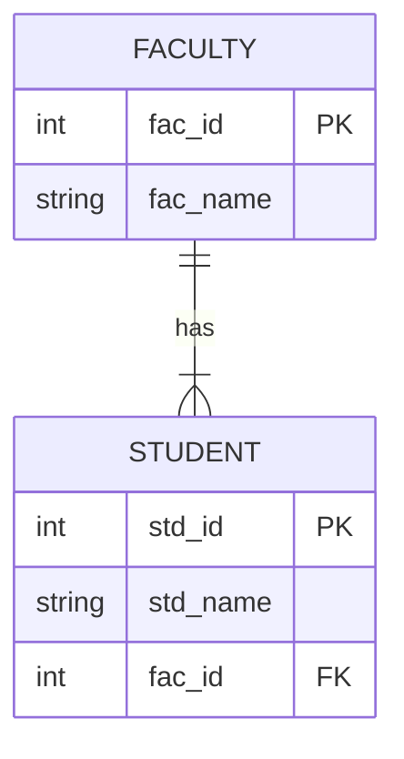

# 🏫 University DB System (Dev Phase)

**"Backend Logic Implementation for Faculty & Students"**

---

## 🎯 Objective
เวอร์ชันพัฒนาระหว่างทาง (Development Build) ของระบบจัดการมหาวิทยาลัย เน้นการทดสอบฟังก์ชัน CRUD (Create, Read, Update, Delete) ของตาราง `student` และ `faculty` ก่อนนำไปประกอบร่างเป็น Final Project

## 🏗️ ER Diagram (Simplified)

## 💻 Key Scripts
- `connectDB.php`: Setup Database Connection
- `addpen_student.php`: Form สำหรับเพิ่มนักศึกษาใหม่
- `search_student.php`: ระบบค้นหาข้อมูล
