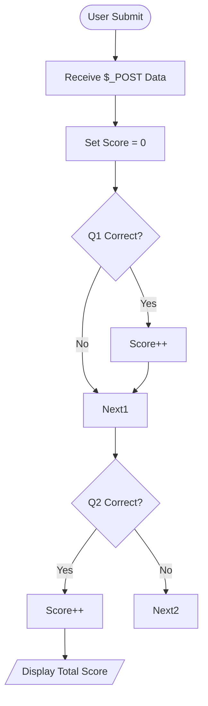

# 📝 Online Quiz Assessment System

<div align="center">


**"Automated Scoring and Feedback Mechanism"**

</div>

---

## 🎯 Problem Statement
การประเมินผลออนไลน์ (E-Assessment) ช่วยลดภาระงานตรวจข้อสอบของอาจารย์ โจทย์คือการสร้างระบบที่รับคำตอบจากผู้เรียน เปรียบเทียบกับเฉลย (Answer Key) และคำนวณคะแนนทันที

## 🏗️ Scoring Logic Flow



## 💻 Tech Implementation
- **Associative Arrays**: ใช้เก็บเฉลย `['q1' => 'a', 'q2' => 'c']` เพื่อความง่ายในการแก้ไข
- **Ternary Operator**: ใช้ลดรูป If-Else ในการตรวจคำตอบ

```php
// Check Answer Logic
$total_score = 0;
$answer_key = ['q1' => 'active', 'q2' => 'server'];

if (isset($_POST['submit'])) {
    foreach ($answer_key as $q => $ans) {
        if ($_POST[$q] == $ans) $total_score++;
    }
}
```

## 💡 Key Learnings
- **Form State**: การใช้ Radio Button `name="q1"` เพื่อให้เลือกได้เพียงข้อเดียว
- **Scalability**: การใช้ Loop + Array ตรวจคำตอบ ทำให้รองรับจำนวนข้อสอบได้ไม่จำกัดโดยไม่ต้องแก้ Code เยอะ
