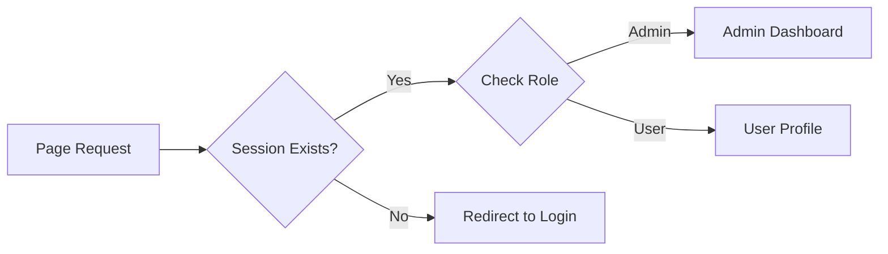

# 🛡️ Advanced Authorization System

<div align="center">


**"Enhanced Logic with Role-Based Navigation"**

</div>

---

## 🎯 Problem Statement
ต่อยอดจากระบบ Login พื้นฐาน สู่การจัดการสิทธิ์การเข้าถึง (Authorization) และการปรับ UI ตามสถานะของผู้ใช้ (Dynamic Menu Validation)

## 🏗️ Logic Flowchart



## 💻 UI Logic
การซ่อน/แสดงปุ่มเมนูตามสถานะการล็อกอิน

```php
<?php if (isset($_SESSION['user'])): ?>
    <a href="logout.php" class="btn btn-danger">Logout</a>
<?php else: ?>
    <a href="login.php" class="btn btn-primary">Login</a>
<?php endif; ?>
```

## 💡 Key Learnings
- **Separation of Concerns**: แยกไฟล์ `header.php`, `footer.php`, `condb.php` เพื่อการดูแลรักษาที่ง่ายขึ้น
- **Role-Based Access Control (RBAC)**: แนวคิดพื้นฐานในการจำกัดสิทธิ์ Admin vs User
